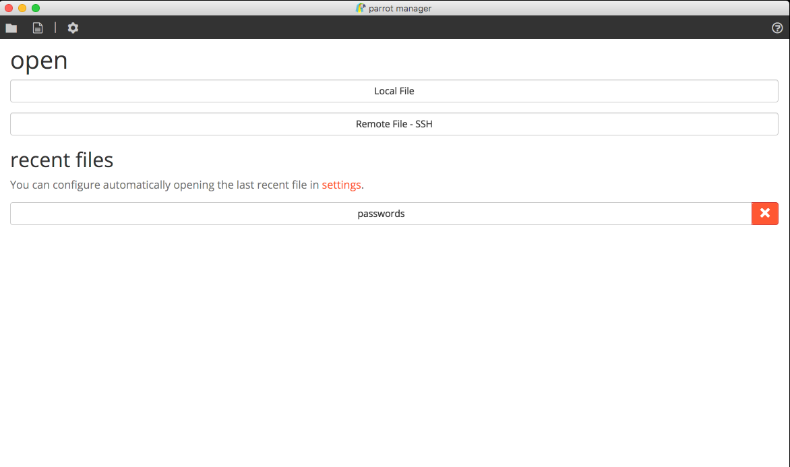
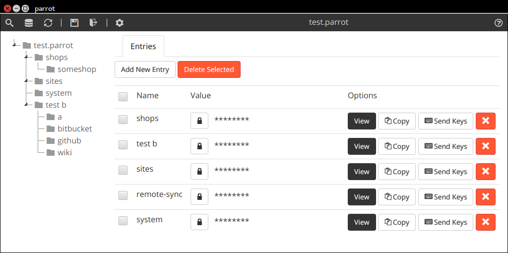
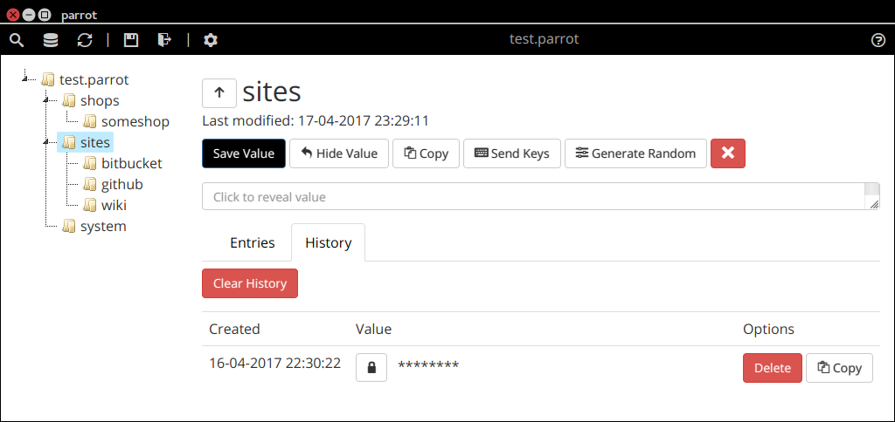
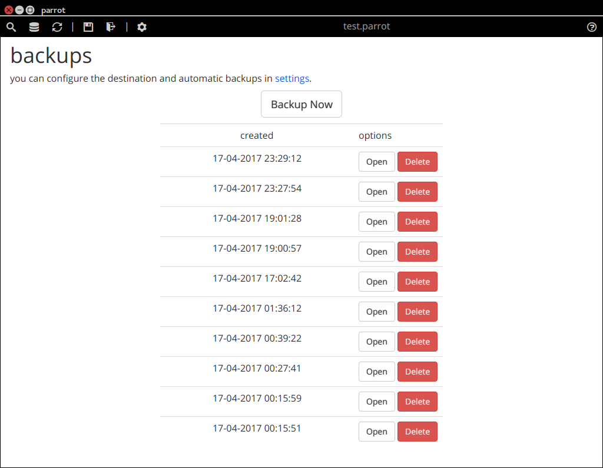
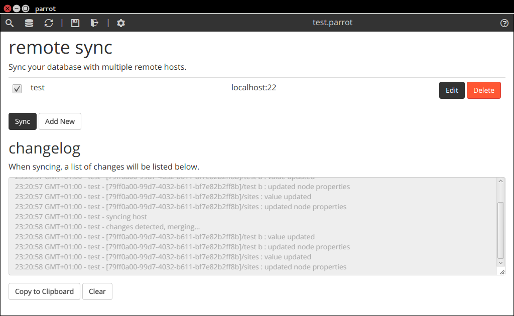
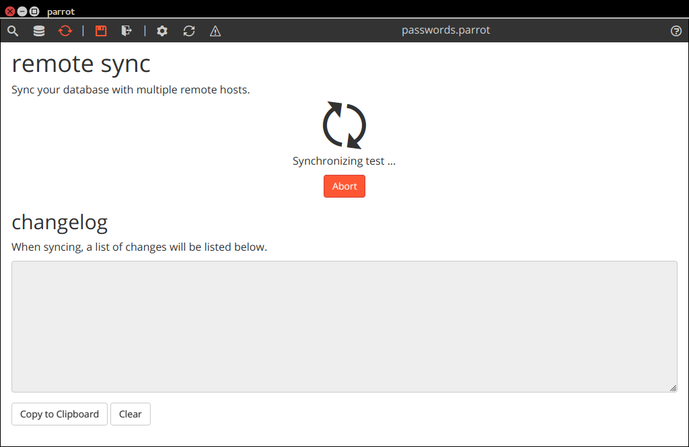
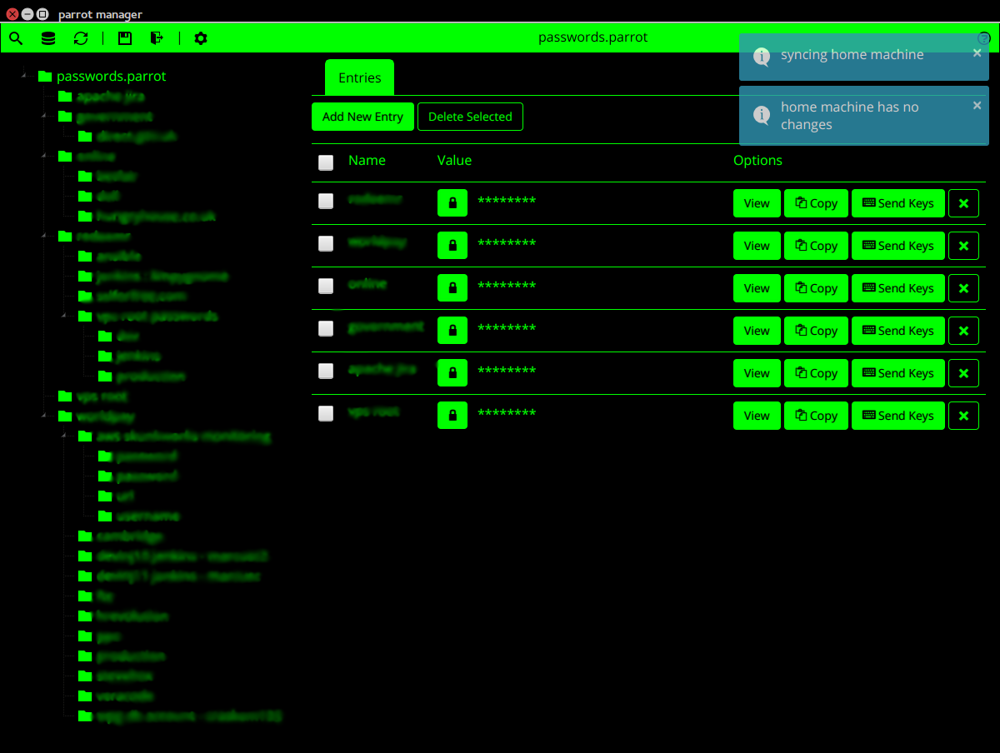
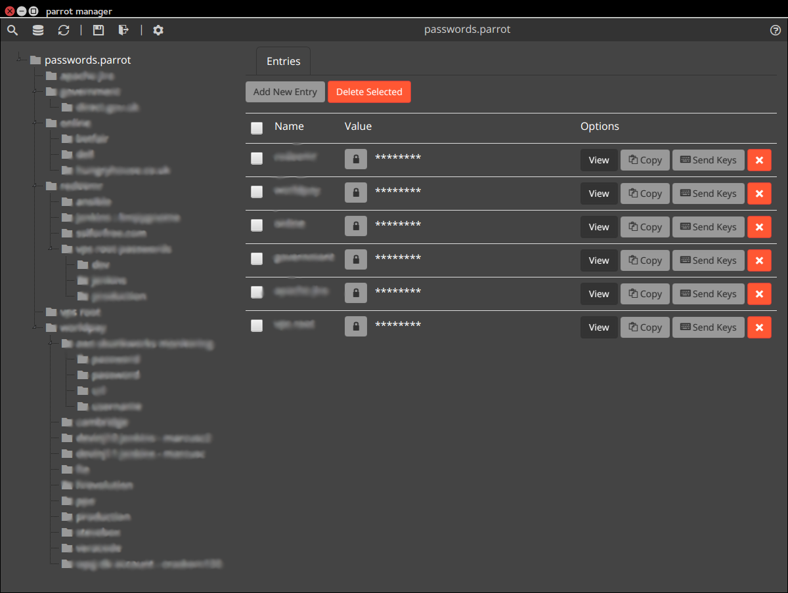
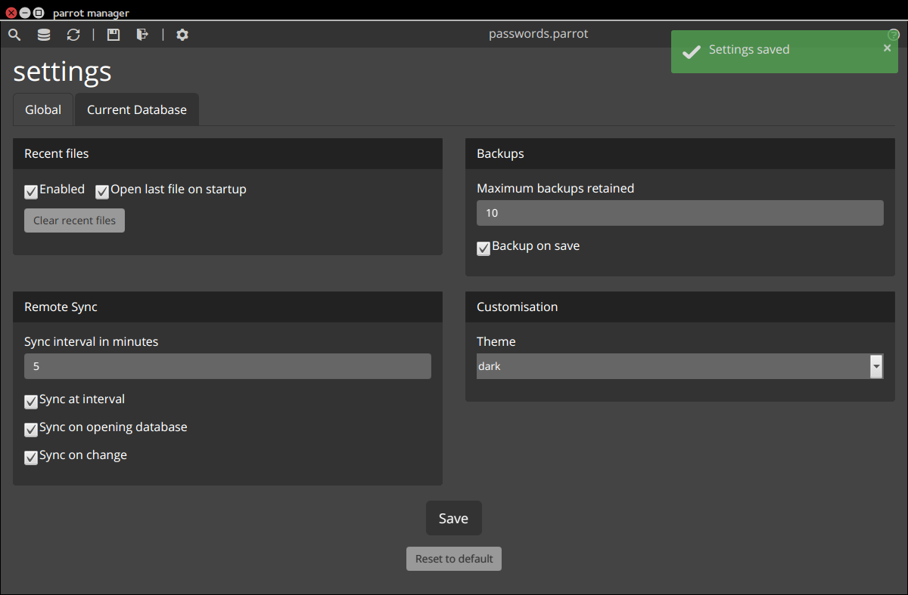
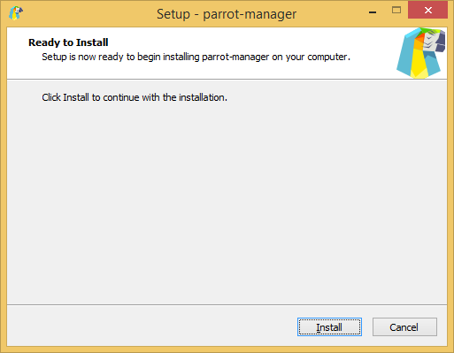

<h1 align="center">
    parrot manager
</h1>
<p align="center">
    <i>passwords made simple</i>
</p>

<p align="center">
    
</p>

[](https://travis-ci.org/limpygnome/parrot-manager)
[](https://github.com/limpygnome/parrot-manager)
[](http://badges.mit-license.org)
[](https://github.com/limpygnome/parrot-manager/issues)
[](https://github.com/limpygnome/parrot-manager/pulls)

A simple password manager with a modern interface, with ability to synchronize databases using SSH.

Supports Linux, Windows and Mac.

## Features
- File encryption
- In-memory encryption (until revealed/copied/etc)
- Automatic backups on save
- Sync databases using SSH
    - Multiple hosts at once
    - Automatic merge to avoid conflicts and losing data
- Copy values to clipboard
- Send values as keys to other applications
- Modern UI

Upcoming features can be seen on the [roadmap](roadmap.md).


## Download
Binaries are available on the [releases](https://github.com/limpygnome/parrot-manager/releases) page.


## Screenshots
<table>
    <tr>
        <td>
            
        </td>
        <td>
            
        </td>
    </tr>
    <tr>
        <td>
            
        </td>
        <td>
            
        </td>
    </tr>
    <tr>
        <td>
            
        </td>
        <td>
            
        </td>
    </tr>
    <tr>
        <td>
            
        </td>
        <td>
            
        </td>
    </tr>
    <tr>
        <td>
            
        </td>
        <td>
            
        </td>
    </tr>
    <tr>
        <td>
            
        </td>
        <td>
            
        </td>
    </tr>
</table>


## Installation
### Prerequisites
- Recommended [Java Runtime 1.9](http://www.oracle.com/technetwork/java/javase/downloads/jre9-downloads-3848532.html)
    - Minimum [Java Runtime 1.8](http://www.oracle.com/technetwork/java/javase/downloads/jre8-downloads-2133155.html), however
      there are various JRE bugs that may cause stability issues.

### Ubuntu / Debian
Download the latest deb file, to anywhere, and run the following command in the same directory; the file name
may differ:

````
sudo dpkg -i parrot-manager.deb
````

### Windows
Both an installer and stand-alone version are available.

For the stand-alone, just extract the executable to anywhere you desire, no installation process is required.

### Mac
Download the latest pkg file, to anywhere, and

### Other Platforms
Download the latest jar zip or tar archive, extract the jar file and run:

````
java -jar parrot-manager.jar
````

File name may differ and no installation process is required, as the JAR is standalone.


## Dependencies

[](https://gemnasium.com/github.com/limpygnome/parrot-manager)
[](https://www.versioneye.com/user/projects/58f5b1d4307d03003e9de24e)

## Contribute
This project is open to [contributions](contribute.md).

Donations can be sent to:
* PayPal: limpygnome@gmail.com
* Bitcoin: 1CwSZwBT5qVbuKABUj2ruz5VyHhY23E6bY
