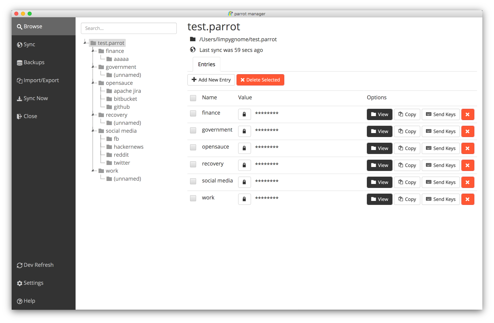

<h1 align="center">
    parrot manager
</h1>

    <i>
        passwords made simple
    </i>

    

A simple password manager with a modern interface, with ability to synchronize databases using SSH.

Supports Linux, Windows and Mac.

    

    More screenshots can be found <a href="https://github.com/limpygnome/parrot-manager/tree/develop/docs/screenshots">here</a>.

## Features
- File encryption
- In-memory encryption (until revealed/copied/etc)
- Automatic backups on save
- Sync databases using SSH
    - Multiple hosts
    - Automatic merge to avoid conflicts and losing data
    - Works in hostile environments
- Copy values to clipboard
    - Automatically clear after period
- Send values as keys to other applications
- Import/export data
    - Currently supports csv and json
- Modern UI
- Standalone mode - useful for memory sticks and restrictive environments

Upcoming features can be seen on the [roadmap](roadmap.md).

## Download
Binaries are available on the [releases](https://github.com/limpygnome/parrot-manager/releases) page.

## Installation
Prerequisites:
- Recommended [Java Runtime 1.9](http://www.oracle.com/technetwork/java/javase/downloads/jre9-downloads-3848532.html).
    - Older versions have stability issues around webkit.

For help installing on your platform, see [installation](docs/installation.md).

## Contribute
This project is open to [contributions](CONTRIBUTING.md).
